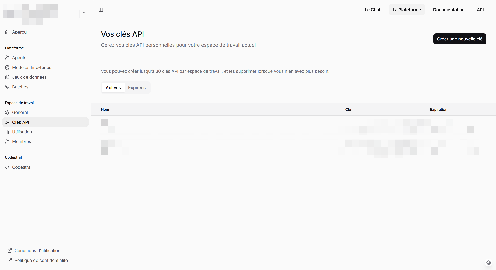
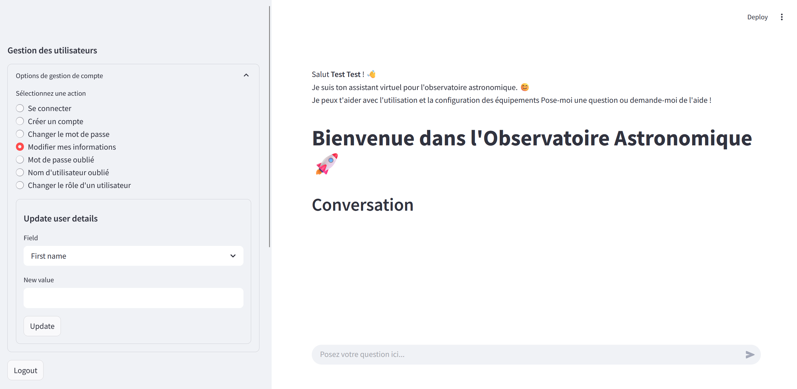
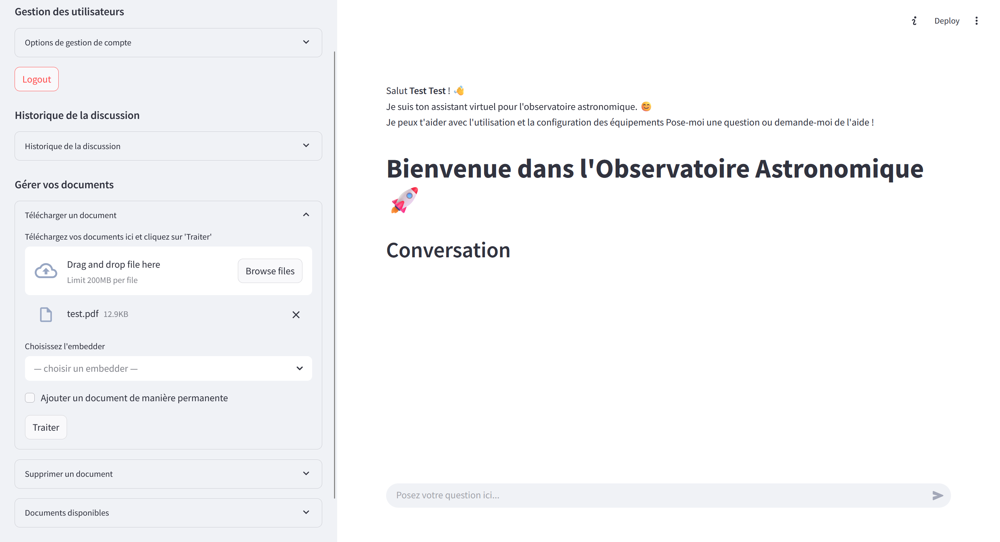

# Chatbot de l'observatoire astronomique de la pointe du diable

## Table des matières

- [Présentation](#présentation)
- [Fonctionnalités](#fonctionnalités)
- [Installation & Utilisation](#installation--utilisation)
  - [Prérequis](#1-prérequis)
  - [Cloner le dépôt](#2-cloner-le-dépôt)
  - [Configurer les variables d'environnement](#3-configurer-les-variables-denvironnement)
  - [Configuration de l'authentification](#4-configuration-de-configyaml-pour-lauthentification)
  - [Construction des images Docker](#4-construction-des-images-docker)
  - [Lancement des conteneurs](#5-lancer-les-conteneurs)
  - [Utilisation de VS Code avec les conteneurs](#7-utiliser-vs-code-avec-les-conteneurs)
- [Guide d'utilisation](#guide-dutilisation)
  - [Gestion des comptes](#gestion-des-comptes)
    - [Comment créer un compte ?](#comment-créer-un-compte)
    - [Comment se connecter ?](#comment-se-connecter)
    - [Comment changer votre mot de passe ?](#comment-changer-votre-mot-de-passe)
    - [Comment changer vos informations personnelles ?](#comment-changer-vos-informations-personnelles)
    - [Mot de passe ou nom d'utilisateur oublié ?](#mot-de-passe-ou-nom-dutilisateur-oublié)
    - [Comment changer le rôle d'un utilisateur ?](#comment-changer-le-rôle-dun-utilisateur)
    - [Comment se déconnecter ?](#comment-se-déconnecter)
  - [Historique des discussions](#historique-des-discussions)
  - [Gestion des documents](#gestion-des-documents)
    - [Comment ajouter un document ?](#comment-ajouter-un-document)
    - [Comment supprimer un document ?](#comment-supprimer-un-document)
    - [Liste des documents disponibles](#liste-des-documents-disponibles)

## Présentation

Ce projet propose un **chatbot intelligent**, conçu pour répondre à des questions basées sur une base documentaire interne (PDFs techniques, manuels, documents de formation).  
Il utilise un pipeline **RAG** (Retrieval-Augmented Generation) combinant :

- **Mistral AI** (`mistral-large-latest` pour la génération de texte)
- **Mistral-Embed** pour les embeddings sémantiques
- **LangChain** pour l'orchestration de la recherche et du dialogue
- **FAISS** pour l'indexation vectorielle locale
- **Streamlit** pour l'interface web utilisateur

Le tout est **conteneurisé avec Docker** afin d'assurer portabilité, reproductibilité et facilité de déploiement.

---

## Fonctionnalités

- **Chat conversationnel contextuel** basé sur l'historique
- **Recherche intelligente** dans les documents PDF internes
- **Un chatbot multimodal** pour traiter des documents complexes
- **Interface utilisateur web** Streamlit responsive

## Installation & Utilisation

### 1. Prérequis

- Docker Desktop
- Git 
- VS Code (extensions recommandées : *Dev Containers*, *Python*, *Jupyter*)
- Compte Mistral AI et clé API valide
- (Optionnel) Compte Hugging Face et un Token valide

### 2. Cloner le dépôt

```bash
git clone https://gitlab-df.imt-atlantique.fr/a24ounza/ai-agent.git
cd ai-agent
```

### 3. Configurer les variables d'environnement

Cette étape permet de fournir les variables d'environnement nécessaires au bon fonctionnement du chatbot.

---

#### 3.1 Créer une clé API Mistral

1. Rendez-vous sur [https://console.mistral.ai/home](https://console.mistral.ai/home).
2. Créez un compte ou connectez-vous via votre compte Google.
3. Dans le menu de gauche, cliquez sur **"Clés API"**.



4. Choisissez un **plan gratuit (Experiment)**.
5. Acceptez les conditions d'utilisation et vérifiez votre numéro de téléphone.
6. Cliquez sur **"Créer une nouvelle clé"** :
   - Donnez un nom à votre clé (par exemple `chatbot-key`)
   - Choisissez une date d'expiration : **"Jamais"**
7. Copiez la clé générée et conservez-la dans un endroit sécurisé.

---

#### 3.2 (Optionnel) Créer un token Hugging Face

Ce token permet d'améliorer certaines fonctionnalités du ChatBot (accès à certains modèles pré-entraînés).  
Le ChatBot fonctionnera même sans, mais son utilisation est recommandée.

Suivez les étapes officielles ici :  
[Créer un access token Hugging Face](https://huggingface.co/docs/hub/security-tokens)

---

#### 3.3 Créer le fichier `.env`

À la racine du projet (dans le dossier source), créez un fichier nommé `.env` contenant vos clés privées :

```env
MISTRAL_API_KEY = "votre_clé_mistral_ici"
HF_TOKEN = "votre_token_huggingface_ici"
SMTP_USER = "votre.email@gmail.com"
SMTP_PASSWORD = "votre_mot_de_passe_d'application"
```

**Variables SMTP (optionnelles) :**
- `SMTP_USER` et `SMTP_PASSWORD` sont nécessaires uniquement pour la fonctionnalité de récupération de mot de passe et nom d'utilisateur oublié.
- Ces variables permettent d'envoyer des emails automatiques aux utilisateurs.
- Si vous ne configurez pas ces variables, la fonctionnalité décrite dans la section ["Mot de passe ou nom d'utilisateur oublié ?"](#mot-de-passe-ou-nom-dutilisateur-oublié-) ne sera pas disponible.
- Pour `SMTP_PASSWORD`, utilisez un mot de passe d'application Gmail (pas votre mot de passe principal).

### 4. Configuration de `config.yaml` pour l'authentification

Cette application utilise [`streamlit-authenticator`](https://github.com/mkhorasani/streamlit-authenticator) pour gérer la connexion et les sessions utilisateurs.  
Pour sécuriser vos identifiants et les cookies de session, suivez les étapes ci-dessous pour créer votre propre `config.yaml`.

#### 1. Ne pas utiliser directement `config.example.yaml`

Ce fichier est un modèle. Vous devez créer votre **propre version sécurisée** et ne jamais la publier dans Git.

#### 2. Créez un fichier `config.yaml`

Créez un fichier `config.yaml` à la racine du projet à partir de l'exemple `config.example.yaml` :

```bash
cp config.example.yaml config.yaml
```

Modifiez les valeurs à l'intérieur, en particulier :

##### Générer une `cookie.key` sécurisée

Cette clé permet de signer les cookies de session afin d'empêcher toute falsification. Elle doit :

- Contenir au moins 16 caractères aléatoires
- Rester secrète (ne jamais la publier)
- Être unique pour chaque instance

Pour en générer une avec Python :

```python
import secrets
print(secrets.token_urlsafe(32))
```

Collez la chaîne générée dans votre `config.yaml` :

```yaml
cookie:
  name: streamlit_auth
  key: "clé_sécurisée_générée_ici"
  expiry_days: 0
```

⚠️ Vérifiez que le fichier `config.yaml` est dans `.gitignore`.

### 4. Construction des images Docker

```bash
docker compose build
```
Cela peut prendre quelques dizaines de minutes.

### 5. Lancer les conteneurs

- **Shell de développement (Obligatoire pour accéder et modifier le code via VS Code)** :
```bash
docker compose up dev -d
```
- **JupyterLab (Si vous voulez utiliser ou ajouter des notebooks Jupyter)** :
```bash
docker compose up jupyter -d
```
Puis ouvrir [http://localhost:8888](http://localhost:8888)

- **Streamlit (Pour lancer le Chatbot)** :
```bash
docker compose up streamlit -d
```
Puis ouvrir [http://localhost:8501](http://localhost:8501)

### 7. Utiliser VS Code avec les conteneurs

- Ouvrir `ai-agent/` dans VS Code.
- `F1` > **Dev Containers: Attach to Running Container**.
- Travailler directement dans l'environnement conteneurisé.

# Guide d'utilisation

## Gestion des comptes

### Comment créer un compte ?


Pour créer un compte, il faut fournir les informations suivantes : 
- First name (Prénom)
- Last name (Nom)
- Un email valide
- Username (Nom d'utilisateur)
- Password (Mot de passe) qui doit :
    - Avoir entre 8 et 20 caractères
    - Contenir au moins une lettre majuscule
    - Contenir au moins un chiffre
    - Contenir au moins un caractère spécial (@$!%*?&)

Enfin, il faut remplir le Captcha et cliquer sur Register.
Tous les utilisateurs sont attribués le rôle "utilisateur" par défaut.

### Comment se connecter ?


Après avoir créé un compte, vous pouvez vous connecter à l'aide de votre Username (Nom de l'utilisateur) et votre Password (Mot de passe), puis cliquer sur Login.

### Comment changer votre mot de passe ?

Il faut obligatoirement être connecté pour changer votre mot de passe. Une fois connecté, vous devez aller à la rubrique "Changer le mot de passe".


Il ne reste qu'à choisir un nouveau mot de passe qui vérifie les conditions citées dans la partie ["Comment créer un compte ?"](#comment-créer-un-compte), remplir les cases :
- Current password (Mot de passe actuel)
- New password (Nouveau mot de passe)
- Repeat password (Répéter le nouveau mot de passe)

### Comment changer vos informations personnelles ?

Il faut obligatoirement être connecté pour changer vos informations. Une fois connecté, il faut accéder à la rubrique "Changer mes informations".



Vous pouvez changer :
- First name (Prénom)
- Last name (Nom)
- Email

Il faut choisir quel champ vous voulez changer dans la case "Field", insérer la nouvelle valeur dans "New value", et valider votre changement en cliquant sur "Update".

### Mot de passe ou nom d'utilisateur oublié ?

---
**⚠️ Remarque :**

Cette fonctionnalité nécessite de fournir les paramètres `SMTP_USER` et `SMTP_PASSWORD` dans le fichier `.env` pour fonctionner. Voir ["Créer le fichier `.env`"](#33-créer-le-fichier-env). 

---

#### Mot de passe oublié :


Il faut accéder à la rubrique "Mot de passe oublié" puis remplir la case "Username" avec votre nom d'utilisateur. Vous allez recevoir un mail (via l'email avec lequel vous avez créé votre compte) qui contient votre nouveau mot de passe.


#### Nom d'utilisateur oublié :


Il faut accéder à la rubrique "Nom d'utilisateur oublié" puis remplir la case "Email" avec l'email avec lequel vous avez créé votre compte. Vous allez recevoir un mail qui contient votre nom d'utilisateur.


### Comment changer le rôle d'un utilisateur ?

---
**⚠️ Remarque :**

Seuls les utilisateurs avec le rôle "admin" ont l'autorité pour changer le rôle des autres utilisateurs.

---

Il faut obligatoirement être connecté. Une fois connecté, un "admin" peut choisir l'utilisateur auquel il veut changer le rôle. Il a le choix entre deux rôles : 
- utilisateur
- admin


### Comment se déconnecter ?

Il suffit de cliquer sur le bouton "Logout".


## Historique des discussions

Pour accéder à l'historique des discussions, il faut aller dans l'onglet "Historique de la discussion".

### Rôle "utilisateur"


Tous les utilisateurs ont accès à leurs conversations précédentes. Pour cela, il suffit d'aller dans le menu "Historique de la discussion", choisir une conversation à partir de la case "— choisir une conversation —". Et puis cliquer sur "Charger cette conversation".

Pour commencer une nouvelle conversation, il faut cliquer sur "Nouvelle conversation".

### Rôle "admin"


Seuls les utilisateurs avec le rôle "admin" ont accès aux conversations de tous les autres utilisateurs. 
Pour accéder aux conversations d'un utilisateur, il faut choisir cet utilisateur dans la case "— choisir un utilisateur —", choisir la conversation dans la case "— choisir une conversation —", et cliquer sur "Charger cette conversation".

## Gestion des documents 

Pour gérer les documents fournis au chatbot, il faut accéder à l'onglet "Gérer vos documents".

### Comment ajouter un document ?

Accédez à la rubrique "Télécharger un document", cliquez sur "Browse files" pour parcourir un document. 

---
**⚠️ Attention :**

Il ne faut parcourir que des fichiers PDF.

---



Une fois fait, deux champs vont apparaître : 
- **"Choisissez l'embedder" :** Vous pouvez à partir d'ici choisir le type d'embedder que vous voulez utiliser. Vous avez le choix entre 3 embedders :
    - **Text only embedder (Rapide) :** Il ne peut traiter que du texte. Idéal pour des documents qui ne contiennent que du texte, ou les documents où seul le contenu du texte est important.
    - **Embedder with OCR (Rapide) :** Il utilise la technique OCR pour scanner et extraire le texte contenu dans les images. Idéal pour les documents scannés (Mais, assurez-vous que les documents sont bien orientés avant de l'utiliser).
    - **Multimodal Embedder (lent) :** Il est capable de comprendre le contenu des images et des tableaux. Idéal pour les documents complexes dont les images et les tableaux contiennent des informations importantes.
- Une fois l'embedder choisi, il ne reste qu'à cliquer sur "Traiter" pour commencer l'indexation du document.

---
**⚠️ Remarque :**

Les utilisateurs avec le rôle "utilisateur" peuvent ajouter un document que temporairement pendant leur session. Seuls les utilisateurs avec le rôle "admin" peuvent ajouter des documents de manière permanente en cochant la case "Ajouter le document de manière permanente".

---

### Comment supprimer un document ?

Accédez à la rubrique "Supprimer un document", choisissez le document que vous voulez supprimer dans la case "— choisir un document —". Ensuite, cliquer sur le bouton "Supprimer".


---
**⚠️ Remarque :**

Les utilisateurs avec le rôle "utilisateur" ne peuvent supprimer un document que temporairement pendant leur session. Seuls les utilisateurs avec le rôle "admin" peuvent supprimer des documents de manière permanente en cochant la case "Supprimer le document de manière permanente".

---

### Liste des documents disponibles 

Pour voir la liste des documents disponibles, il faut accéder à l'onglet "Documents disponibles". Vous allez y trouver le nombre de documents ainsi que la liste des documents. 

